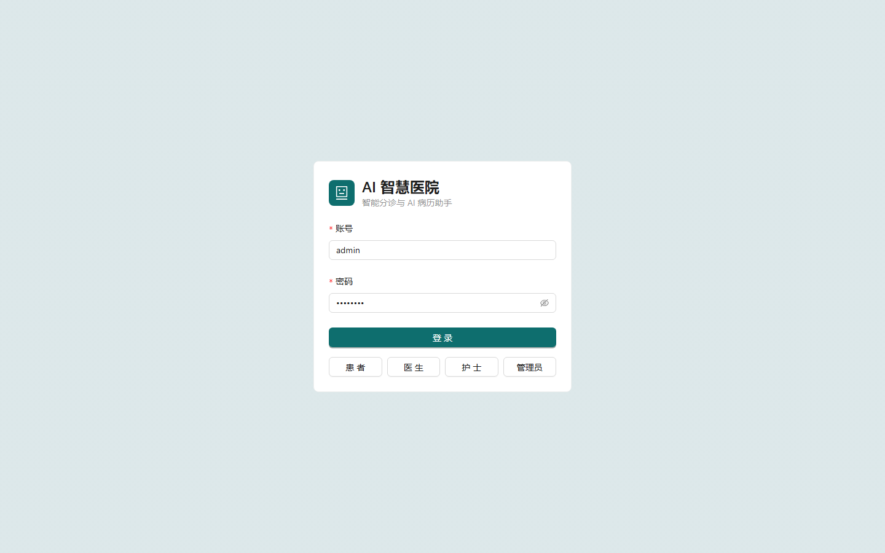
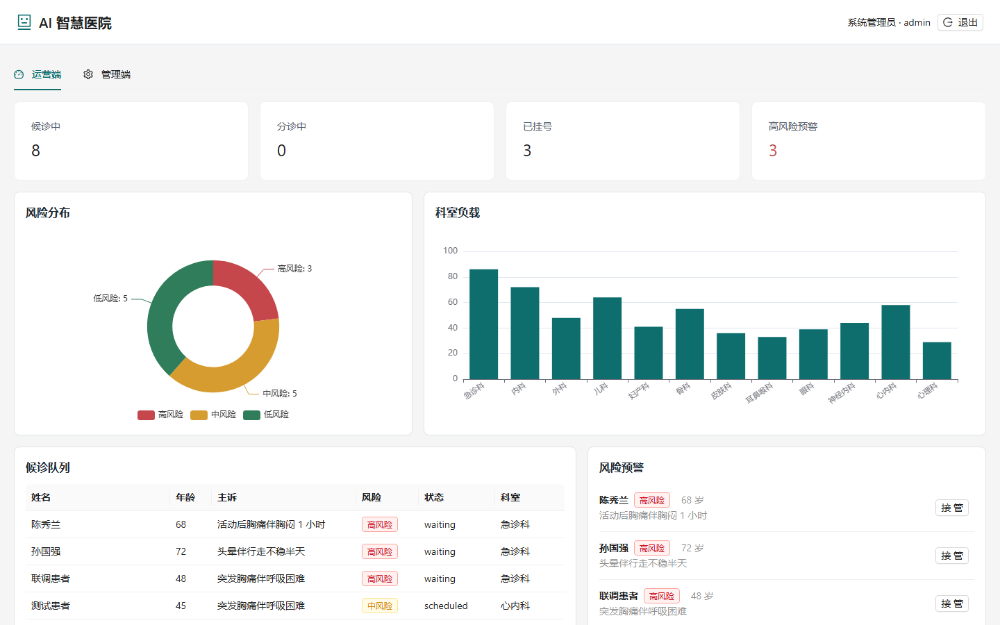

# AI 智慧医院平台

从 0 到 1 搭建的 AI 智慧医院平台原型，覆盖患者智能预问诊与分诊、医生 AI 病历助手、运营风险预警、知识库与审计管理四类核心场景。


## 功能概览

- 患者端：多轮结构化预问诊、规则 + 模型双通道风险分级、科室推荐、预约挂号。
- 医生端：患者列表、AI 病历摘要、SOAP 草稿、随访计划、医疗知识库检索，结论带引用来源。
- 运营端：候诊队列、科室负载、风险分布、高风险预警、护士人工接管、审计日志。
- 管理端：知识库维护、审计日志、模型与系统状态。

## 项目演示

演示流程：

1. 患者登录并描述症状，完成多轮智能预问诊。
2. 系统输出红黄绿风险分级和推荐科室。
3. 患者预约挂号，进入候诊队列。
4. 医生查看 AI 病历摘要、SOAP 草稿和随访计划。
5. 运营端展示科室负载、风险分布和高风险预警。

演示截图：





## 技术栈

- 前端：React 19 + TypeScript + Vite + Ant Design + ECharts
- 后端：Python FastAPI + SQLAlchemy + PyJWT
- 数据：SQLite 默认运行，`DATABASE_URL` 可切换 PostgreSQL + pgvector；RAG 使用 BM25 + 向量混合召回
- AI：兼容 OpenAI 与 Anthropic（DeepSeek）风格的模型网关，支持云端 API 与本地 Ollama/vLLM；未配置 Key 时自动使用确定性降级引擎

## 快速启动

### 1. 启动后端

```bash
cd backend
python -m venv .venv
.venv/Scripts/activate
pip install -r requirements.txt
uvicorn app.main:app --reload --port 8000
```

### 2. 启动前端

```bash
cd frontend
pnpm install
pnpm dev
```

打开 http://localhost:5173。

### 3. Docker Compose 一键启动（可选）

本机安装 Docker 后，在项目根目录执行：

```bash
docker compose up --build
```

服务会自动启动 pgvector 数据库、后端和前端。需要真实模型 Key 时，复制根目录 `.env.example` 为 `.env` 并填写 `LLM_API_KEY`。

### 4. 一键 Demo 模式（推荐演示）

```bash
pnpm --dir frontend build
.\start_demo.ps1
```

打开 http://127.0.0.1:8000 即可体验完整流程。Demo 模式将前端构建产物直接托管在后端服务中，不需要单独启动 Vite。

## 演示账号

| 角色 | 账号 | 密码 |
| --- | --- | --- |
| 患者 | `patient_demo` | `demo123` |
| 医生 | `doctor_zhang` | `doctor123` |
| 护士 | `nurse_liu` | `nurse123` |
| 管理员 | `admin` | `admin123` |

## 接入真实大模型

复制 `backend/.env.example` 为 `backend/.env`，填写：

```env
LLM_API_KEY=your-key
LLM_BASE_URL=https://api.deepseek.com/anthropic
LLM_MODEL=deepseek-v4-flash
LLM_STYLE=anthropic
```

不填写时系统使用本地规则与模板降级，不影响演示。

## 测试

```bash
cd backend
.venv/Scripts/python -m pytest -q
```

## CI 与自动化评测

仓库已内置 GitHub Actions 工作流：

- `.github/workflows/ci.yml`：每次 push 或 PR 自动运行后端测试、前端构建和规则模式评测，并上传 `eval-report-rule` 评测报告。
- `.github/workflows/model-eval.yml`：在 GitHub Actions 页面手动触发，使用真实模型跑完整 50 例评测，并上传正式评测报告。

手动模型评测前，需要在 GitHub 仓库 Settings -> Secrets and variables -> Actions 中配置：

```text
LLM_API_KEY=<你的 Key>
LLM_BASE_URL=https://api.deepseek.com/anthropic
LLM_MODEL=deepseek-v4-flash
LLM_STYLE=anthropic
```

本地生成规则模式报告：

```bash
cd backend
.venv/Scripts/python eval/run_evaluation.py --mode rule --output-suffix=-rule
```

## 最新评测结果

基于 50 例内部评测集，由 GitHub Actions 使用 `deepseek-v4-flash` 实测生成：

| 指标 | 数值 |
| --- | --- |
| 最终分级准确率 | 82.0% |
| 最终科室准确率 | 86.0% |
| RAG 引用命中率 Top3 | 94.0% |
| 红色高风险召回率 | 100.0% |
| 单例评估延迟 P50 | 1.57 秒 |
| 单例评估延迟 P95 | 3.15 秒 |

完整报告见 [AI智慧医院-评测报告-第一版.md](outputs/AI智慧医院-评测报告-第一版.md)。

## 项目结构

```text
backend/
  app/
    ai/         模型网关、分诊规则、RAG、病历助手
    routers/    认证、预问诊、患者、运营、管理 API
    models.py   数据模型
    seed.py     演示数据
frontend/
  src/
    pages/      患者端、医生端、运营端、管理端
    components/ 登录、风险标签、图表
```

## 说明

项目使用 Synthea 风格的合成演示数据，不包含真实患者信息；所有 AI 输出仅用于就诊引导与医疗人员参考，不构成医学诊断或治疗建议。
