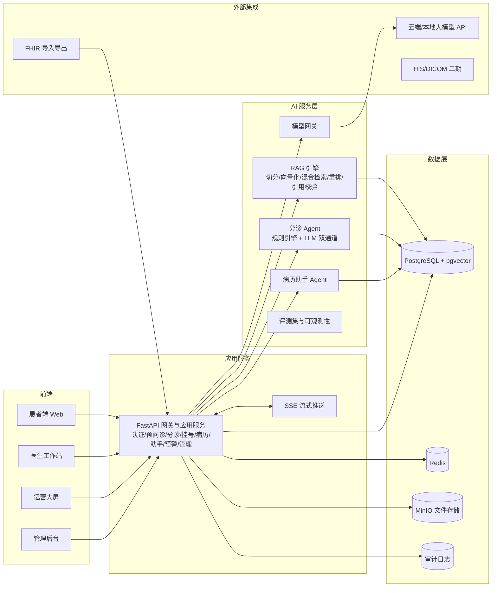

# AI 智慧医院项目规划书

## 0. 文档状态与后续动作

- 当前阶段：需求对齐、GitHub 开源调研、技术方案设计，尚未进入代码实现。
- 本文档给出推荐方案和需要用户确认的决策点。
- 用户确认后进入下一阶段：细化 PRD、页面原型、数据模型、开发排期，再开始编码。

## 1. 需求对齐

### 1.1 项目定位（推荐）

项目建议定位为 **AI 智慧医院平台（AI Smart Hospital Platform）**：面向二级医院、社区医院、互联网医院或智慧医疗方案演示场景的“AI 门诊智慧化平台原型”，重点解决三件事：

1. 患者到院前完成结构化预问诊与风险分诊，减少无效排队和人工采集。
2. 医生用 AI 助手快速掌握病史、生成病历草稿和随访计划，降低文书负担。
3. 运营人员通过实时大屏掌握候诊、科室负载和风险预警，支持人工接管。

### 1.2 路线选择

| 路线 | 内容 | 适合人群 | 建议 |
| --- | --- | --- | --- |
| A. 智慧医院产品原型 | AI 患者服务 + AI 医生助手 + 运营大屏，真实业务闭环 | 全栈、AI 应用、产品向简历 | 推荐，最能体现工程闭环和业务价值 |
| B. 多智能体虚拟医院 | AI 医生、AI 患者、AI 考官仿真，面向教学/研究 | 算法、研究向简历 | 研究价值高，但离产品远，适合作为二期模块 |
| C. 医疗 AI 能力中台 | 只做模型网关、RAG、评测与知识库 | 后端、平台向简历 | 工程清晰，但业务价值展示较弱 |

推荐 **路线 A**，并把“虚拟医院教学舱”和“医学影像辅助”设计为后续扩展模块，保持架构可演进。

### 1.3 目标用户与核心场景

| 角色 | 核心场景 |
| --- | --- |
| 患者 | 在线描述症状，完成预问诊；获得风险等级、科室建议和挂号结果；咨询健康问题 |
| 医生 | 查看患者列表；一键生成病历摘要；基于病史和知识库生成 SOAP 草稿与随访计划 |
| 护士/运营 | 查看分诊台、候诊队列、科室负载、风险预警；接管高风险患者对话 |
| 管理员 | 管理用户权限、知识库、模型配置、审计日志 |

### 1.4 范围边界（重要）

- 不做真实 HIS 的收费、药房、医保、住院结算等重模块，只做与 AI 和门诊流程强相关的业务。
- 不接入真实患者数据；演示数据全部使用 Synthea 生成的合成 FHIR 数据。
- 不做医疗诊断结论；AI 输出为辅助建议，必须带免责声明、引用和人工确认。
- MVP 不包含医学影像、语音、模型微调、真实医院接口对接。

## 2. 简历卖点与成果框架

项目的简历叙事建议统一为 **“做了什么、怎么做、效果如何”**：

- 做了什么：交付患者智能分诊、医生 AI 病历助手、运营风险预警三大闭环。
- 怎么做：FastAPI + React + PostgreSQL/pgvector + LLM/RAG + FHIR，模型网关可切换，工程化完整。
- 效果如何：以分诊准确率、预问诊完整度、摘要引用率、响应延迟、部署演示效率五类指标衡量。

可单独使用的简历描述见同目录《AI智慧医院-简历项目描述.md》。

## 3. GitHub 同类开源项目调研

### 3.1 调研结论概览

开源生态大致分四类：完整 HIS/EMR、医疗大模型、医疗 RAG、AI 医院/多智能体。结论：

- 完整 HIS 只适合作为业务范围和领域模型参考，不适合作为本项目代码基础。
- 医疗大模型不能直接当产品，需要 RAG、规则引擎、评测和安全边界。
- 医疗 RAG 有现成方法论和评测体系，是本项目 AI 底座最重要的参考。
- “AI 医院”目前多为研究原型或概念项目，成熟度不足，但架构思想值得借鉴。

### 3.2 最具参考价值的项目

| 项目 | 类型 | 2026-08 状态 | 许可证 | 参考价值 |
| --- | --- | --- | --- | --- |
| MedRAG（gzxiong/MedRAG） | 医疗 RAG 工具包与 MIRAGE 基准 | 585 stars，ACL 2024 | 许可不明确 | 检索方案、语料组织、评测方法直接可用 |
| HuatuoGPT | 中文医疗大模型 | 1319 stars | Apache-2.0 | 中文医疗 SFT 数据、奖励模型、评测方法 |
| MedicalGPT | 医疗大模型训练流水线 | 5726 stars，活跃 | Apache-2.0 | 后续微调时直接复用 PT/SFT/DPO/ORPO 流程 |
| Awesome-AI4Med | 医疗 AI 资源索引 | 2863 stars，活跃 | 未明确 | 模型、数据、基准的选择地图 |
| h-care | AI 分诊 + 医护协同一体原型 | 新项目，0 stars | MIT | 规则+模型双通道分诊、人工接管、PHI 边界，思想价值最高 |
| OpenEMR | 完整开源 EHR | 5374 stars，活跃 | GPL-3.0 | 业务功能参考和 AI Copilot 集成范式 |
| OpenHIS | 中文开源医院信息系统 | 130 stars | GPL-3.0 | 门诊、住院、药房等模块清单和业务流程参考 |
| HAPI FHIR | FHIR R4 服务端 | 537 stars，活跃 | Apache-2.0 | FHIR 互操作标准参考，二期可按需部署 |
| AI_Hospital | 多智能体虚拟医院 | 195 stars，MIT | MIT | 做虚拟医院模块时参考医生/患者/考官 Agent 设计 |
| MONAI / OHIF | 医学影像 AI 与 DICOM 查看器 | MONAI 8601 stars，OHIF 4296 stars | Apache-2.0 / MIT | 二期影像辅助和影像浏览 |

### 3.3 值得复用的能力

1. **FHIR R4 + Synthea**：用 FHIR 作为病历数据标准，用 Synthea 生成合成患者和检查结果，解决演示数据问题。
2. **MedRAG 的方法论**：借鉴 BM25、稠密检索、医学专用检索器、多语料组合和 MIRAGE 评测方式，搭建自己的 RAG 评测集。
3. **HuatuoGPT 数据与 Awesome-AI4Med 基准**：复用中文医疗问答数据格式和 CMB、MedQA、MedBench 等评测基准，用于模型选型和效果验证。
4. **h-care 架构思想**：采用“确定性规则 + 大模型”双通道分级，风险相斥时向高等级靠拢；护士可人工接管；敏感信息不进入第三方模型。
5. **OpenEMR 的 Clinical Copilot 范式**：AI 只读病历、结构化校验引用、不生成不可验证的临床结论，是医生端助手的正确姿势。
6. **MedicalGPT 流水线**：后续做模型微调时复用 LoRA、SFT、DPO/ORPO 流程，不需要重新造轮子。
7. **OHIF 查看器**：二期做影像模块时直接嵌入，避免从零写 DICOM 前端。

### 3.4 需要避开的坑

1. **不要从零做完整 HIS**：OpenEMR、OpenHIS 都证明了这是一条巨量工程线；本项目聚焦 AI 层和门诊闭环即可。
2. **不要让 LLM 直接给诊断或用药建议**：必须有确定性规则、RAG 引用、输出校验和人工确认，否则安全与合规风险极高。
3. **不要使用真实患者数据**：统一用 Synthea 合成数据，并建立脱敏和审计边界。
4. **不要直接复制 GPL 代码**：OpenEMR、OpenHIS 为 GPL-3.0，照搬源码可能污染项目许可证；只参考流程、模型和标准。
5. **不要依赖已归档项目**：如 HospitalRun 已归档，选型时优先活跃项目。
6. **不要在 MVP 阶段训练模型**：7B 以上全参或 LoRA 训练成本高，先用 API + 本地推理 + RAG 验证业务价值。
7. **不要一上来做医学影像/多模态**：DICOM、标注数据、模型评测复杂度高，放到二期。
8. **不要迷信“AI Hospital OS”类概念仓库**：部分新仓库只有演示效果、无真实工程深度，参考价值低。
9. **不要全链路 LangChain 黑盒**：AI 编排要可观测、可评测、可降级，核心规则必须确定性实现。
10. **不要把“AI 分诊”包装成“AI 诊断”**：产品边界、免责声明和评测口径必须保持一致。

## 4. 技术选型

| 层级 | 推荐方案 | 选择理由 | 备选 |
| --- | --- | --- | --- |
| 前端 | React 19 + TypeScript + Vite + Ant Design + ECharts + TanStack Query | 适合医疗类密集业务界面，生态成熟，AI 对话流式展示方便 | Vue 3 + Element Plus |
| 后端 | Python 3.12 + FastAPI + SQLAlchemy + Alembic + Pydantic | AI 生态最好，异步与 SSE 流式支持优秀，开发效率高 | Java Spring Boot |
| 异步任务 | Redis + Dramatiq/Celery | 处理知识库索引、报告生成、随访提醒等异步任务 | Kafka + Arq |
| 数据库 | PostgreSQL 16 + pgvector | 一份数据库同时承载业务数据和向量检索，简化架构 | Milvus + MySQL |
| AI 模型 | OpenAI 兼容模型网关：云端 API + Ollama/vLLM 本地模型可切换 | 兼顾效果、成本和私有化演示 | 只接单一厂商 |
| 文本向量 | BGE-M3 或同级别中文向量模型 | 中文医疗文本效果好 | OpenAI embedding |
| RAG | 混合检索：BM25 + 向量召回 + 重排；引用校验 | 医学场景必须可溯源、可评测 | 纯向量检索 |
| Agent 编排 | LangGraph 只用于多步 Agent，核心逻辑保持确定性 | 可控、可观测，避免黑盒 | 自研工具调用层 |
| 数据标准 | FHIR R4（fhir.resources 校验 + Synthea 合成数据） | 提高专业度和扩展性，方便后续对接 HIS | 自定义病历模型 |
| 安全 | JWT + RBAC + 审计日志 + 脱敏 + 免责声明 | 医疗项目基本盘，也是简历亮点 | OAuth2/OIDC |
| 部署 | Docker Compose + GitHub Actions | 一键演示、CI 自动测试 | Kubernetes |

## 5. 系统框架

框架说明：

- 前端统一通过 FastAPI 服务访问业务和 AI 能力，AI 对话使用 SSE 流式返回。
- 模型网关是 AI 层的唯一入口，云端 API 与本地模型可配置切换，避免厂商锁定。
- 分诊采用“确定性规则引擎 + 大模型”双通道，规则可审计，模型负责补充语义判断。
- 所有 AI 结论必须经过 RAG 引用校验；无法引用或置信度不足时，只给“信息不足”并引导人工处理。
- 数据层以 PostgreSQL + pgvector 为主，Redis 负责缓存和异步队列，审计日志单独落库。
- FHIR 作为数据交换标准，MVP 阶段先做导入导出和内部数据结构对齐，二期再决定是否部署 HAPI FHIR。

## 6. MVP 范围与验收标准

### 6.1 MVP 功能范围

| 模块 | 功能 |
| --- | --- |
| 患者端 | 多轮结构化预问诊；风险红黄绿分级；科室推荐；号源与预约；带安全边界的健康咨询 |
| 医生端 | 患者列表；AI 病历摘要；SOAP 草稿；随访计划；知识库检索；结论引用展示 |
| 运营端 | 实时候诊队列；科室负载；分诊分布；风险预警；高风险对话人工接管 |
| 管理端 | 用户与 RBAC；知识库管理；模型配置；审计日志；免责声明配置 |
| 数据与工程 | Synthea 合成患者导入；FHIR 导入导出；单元/接口/评测测试；Docker 一键启动；README 与部署文档 |

### 6.2 MVP 验收标准

- 内置至少 20 个合成患者、10 个科室、200 条以上知识库条目。
- 预问诊全流程可演示：症状采集、风险分级、科室推荐、预约完成。
- AI 摘要可对任意演示患者生成，且关键结论都能溯源到病历或知识库。
- 分诊双通道一致性可评测，评测集至少 50 条，并与专家标注比对。
- 权限隔离：患者、医生、运营、管理员角色访问边界通过测试。
- 任何 AI 输出都带免责声明；高风险场景必须进入人工确认流程。

## 7. 开发顺序与里程碑

预计单人全职 6-8 周，建议按以下顺序推进：

| 里程碑 | 周期 | 交付物 | 完成标准 |
| --- | --- | --- | --- |
| M0 需求与设计 | 0.5-1 周 | PRD、页面原型、数据模型、AI 评测集草案 | 关键流程和指标确认 |
| M1 工程底座 | 1-2 周 | 仓库、认证/RBAC、合成数据、CI、Docker | 三端空壳可启动，测试可跑 |
| M2 AI 底座 | 1 周 | 模型网关、RAG、评测集、安全边界 | 可对知识库问答并输出引用 |
| M3 患者端 | 1.5 周 | 预问诊、双通道分诊、挂号闭环 | 端到端演示通过 |
| M4 医生端 | 1.5 周 | 病历摘要、SOAP、随访、知识检索 | 引用校验通过 |
| M5 运营端与打磨 | 1 周 | 大屏、人工接管、审计、文档、部署 | 一键部署演示 |

二期可选方向：

- 医学影像：OHIF 查看器 + MONAI 基础辅助分析。
- 多智能体虚拟医院：参考 AI_Hospital 和 Agent Hospital 思路，做教学与评测舱。
- 模型微调：复用 MedicalGPT 流水线，基于中文医疗数据做 LoRA 微调。
- 真实系统对接：HAPI FHIR、HIS 接口、医保/卫健平台。

## 8. 效果衡量体系

| 指标 | 衡量方式 | 目标值（待实测） |
| --- | --- | --- |
| 分诊准确率 | 与专家标注的红黄绿分级比对 | [85%+] |
| 预问诊信息完整度 | 关键结构化字段采集完成比例 | [90%+] |
| AI 摘要召回率 | 与人工金标准摘要比对关键信息 | [90%+] |
| 引用准确率 | 抽样人工核验每条结论来源 | [95%+] |
| 首字响应 | 在线 API 压测 | [2 秒内] |
| 完整回答 P95 | 在线 API 压测 | [10 秒内] |
| 安全边界 | 越权访问测试、脱敏测试、审计覆盖 | [0 越权，100% 脱敏] |
| 工程质量 | 单元测试、接口测试、AI 评测集通过率 | [全部通过] |

说明：以上为规划和目标值。项目实测后，用真实数据替换，才能写入简历“效果”部分。

## 9. 风险与应对

| 风险 | 应对 |
| --- | --- |
| 医疗 AI 安全与合规风险 | 只用合成数据；AI 只做辅助建议；规则引擎兜底；人工接管；免责声明 |
| 大模型幻觉 | RAG 引用校验、输出验证、拒绝信息不足场景 |
| 工作量失控 | MVP 严格裁剪，先做 AI 闭环，不做 HIS 重模块 |
| 许可证问题 | 只参考 GPL 项目设计，不复用其代码；优先 Apache/MIT 组件 |
| 模型效果不稳定 | 模型网关多供应商切换；建立评测集持续回归 |
| 简历数据失真 | 所有指标先标注为目标值，实测后替换 |

## 10. 需要你确认的决策点

1. 路线选择：是否采用推荐的“路线 A 智慧医院产品原型”？
2. 技术栈：是否接受 Python FastAPI + React + PostgreSQL/pgvector 这套选型？
3. 模型策略：是否接受“云端 API 为主 + 本地 Ollama 兜底”的混合方案？
4. 二期方向：是否需要规划医学影像或虚拟医院模块？
5. 简历目标：简历目标岗位是全栈/AI 应用/算法中的哪一种？
6. 时间投入：预计全职开发周期是 4 周、6 周还是 8 周？

确认以上决策后，下一阶段将细化 PRD、页面原型、数据库 ER 图、API 设计和开发排期，再进入代码实现。
